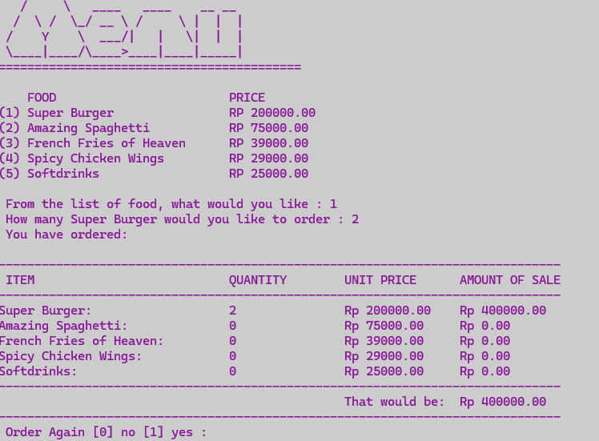

About this project :
  1. This project visualize about Restaurand Menu
  2. There is many option like drinking, frencies, and food
  3. This program build with C languange

About this feature :
  1. This program can calculate give change
  2. This program can show Invocie.
  3. This program can calculate Subtotal
  4. This program can make many transaction

How to run :
  1. Download C++ Compiler / C (name Dev C++)
  2. Download My file -> open file in application
  3. Run The code
  4. Try to visualize and demo program

# Documentations 

